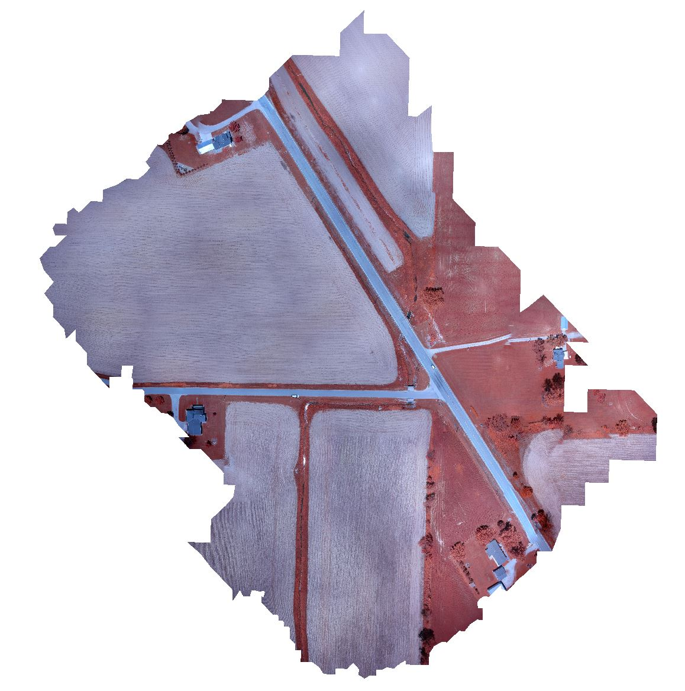

# Seneca Aerial Dataset

## Description

This is an aerial dataset provided by the Ohio Department of Transportation. It
captures parts of several farm fields, though it's unknown what the crops are
and when they were planted. This dataset was captured on June 4th, 2013, so it
is very early in the growing season and the plants are barely visible.

They were captured with a NIR-adapted Canon PowerShot ELPH 300 HS captured by a
SenseFly Swinglet-Cam drone. This is a fixed-wing aircraft without a gimbal, so
while best-efforts were made to keep the camera nadir, not every image is so.

## Imagery

Images are geotagged JPEGs with dimensions 3600x2700, though the first image
(IMG_0446.jpg) is only 3240x2430 for an unknown reason.
